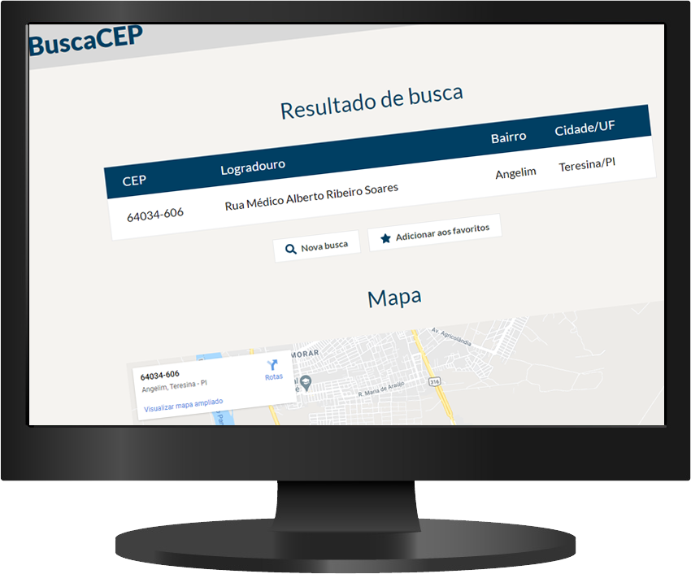

# Busca CEP

## Sobre o projeto
O Busca CEP é um site onde o usuário pode pesquisar por um CEP e, serão renderizadas suas respectivas informações (logradouro, cidade, etc), junto com um mapa apontando para o CEP informado.
Além disso, o usuário pode salvar o CEP pesquisado aos favoritos e o acessar novamente de maneira mais rápida sempre que desejar.

## Como rodar o projeto na sua máquina
1. Clone o projeto com `git clone https://github.com/larissabenedet/busca-cep.git`
2. `cd buscacep` para entrar na pasta no projeto
3. `npm install` para instalar as dependências do projeto
4. `npm start` para iniciar o servidor
5. Acesse o servidor no browser em `localhost:3000`